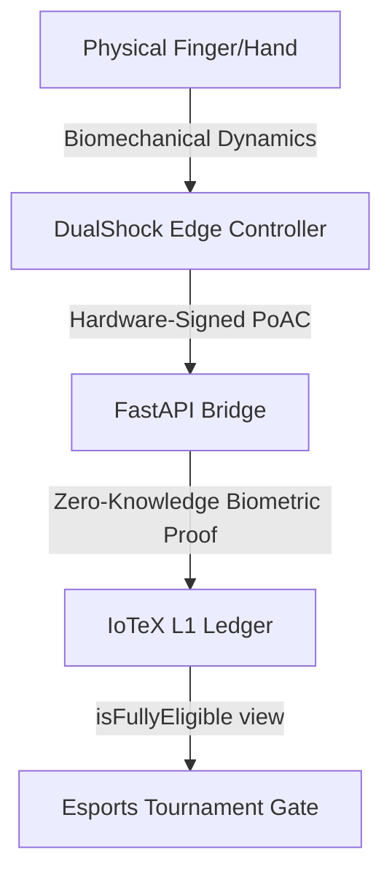

# QorTroller Architecture: In-Depth Features, Use Cases, & Zero-Trust Paradigm

This document provides a comprehensive technical assessment of **QorTroller**, the reference implementation of **Verifiable Autonomous Physical Intelligence (V.A.P.I.)** on the IoTeX network. It details the underlying cryptographic and physical trust models, specific use cases, and biometric features that are not fully elaborated in the main README.

---

## 1. The Zero-Trust Paradigm: V.A.P.I. vs. Ring-0 (Kernel) Anti-Cheat

Traditional anti-cheat systems (e.g., Riot Vanguard, Easy Anti-Cheat, BattlEye) operate under a **trusted-host model** with high system privilege. They monitor operating system memory, inspect running processes, and hook kernel routines at Ring 0. This model has three severe security and operational flaws:
1. **Host Compromise Vulnerability**: Cheats running on hardware DMA (Direct Memory Access) cards, external hardware pass-through devices (like Cronus Zen or XIM), or secondary cheat PCs are invisible to kernel drivers because the operating system itself is bypassed.
2. **Biometric & Consent Intrusiveness**: Kernel drivers gather broad system metrics, exposing user privacy to potential leaks and operating system instability.
3. **Integrator Trust**: Game developers and tournament organizers must trust a proprietary, closed-source anti-cheat API to make eligibility decisions.

### QorTroller's Zero-Trust Physical Trust Model
QorTroller flips the security model by treating the host machine as **entirely compromised**. Instead of checking the *software environment*, it validates the **physics of the physical input stream** at the hardware/sensor level:



- **Hardware-Rooted Proofs**: Raw inputs (accelerometer, gyroscope, triggers) are bound to a hardware-rooted signature directly on the controller, creating a **Proof of Autonomous Cognition (PoAC)**.
- **Physics-Backed Defense**: Bot scripts, DMA input injection, and Cronus macros cannot synthesize the biomechanical noise, postural gravity tremors, or muscle-latency feedback loops characteristic of a living human hand.

---

## 2. Deep-Dive: The PITL Layer Stack and Biometric Features

While the README summarizes the Physical Input Trust Layer (PITL) stack, the specific signals and mathematical models mapped to each layer include:

### L2: IMU Gravity & HID Discrepancy
* **Inference**: Analyzes the relationship between the physical gravity vector (measured by the internal 3-axis accelerometer) and active gameplay commands.
* **Mechanism**: If a bot script injects analog stick movements (e.g., strafing at exactly $100\%$ stick deflection) while the physical controller remains perfectly stationary on a desk (accelerometer variance $\sigma^2 \approx 0$), this discrepancy triggers a hard cheat block code (`0x28`).

### L3: TinyML Behavioral Classifier
* **Inference**: Runs edge-inference neural networks trained on high-dimensional human controller dynamics.
* **Mechanism**: Distinguishes human muscle-twitch acceleration curves from the step-function inputs typical of software bots. A bot injecting click events does so with zero pre-onset tension or muscle-microtravel; humans display a biomechanical acceleration ramp before trigger-clicks.

### L4: 13-Feature Mahalanobis Fingerprint
* **Inference**: Computes the distance of the active session's biometric fingerprint to the player's calibrated baseline.
* **Biometric Features**:
  1. **Postural Gravity roll_cos & roll_sin**: Anatomically stable gravity angles ($\cos/\sin(\theta_{roll})$) matching how the player physically holds the controller relative to their lap/desk,circular-encoded to avoid wraparound artifacts.
  2. **Postural Gravity pitch_cos**: Pitch postural angle ($\cos(\theta_{pitch})$).
  3. **Accel Tremor Peak Frequency (FFT)**: 4096-point zero-padded Fast Fourier Transform of raw acceleration, using parabolic sub-bin interpolation to pinpoint micro-tremors in the $4.0 - 15.0$ Hz band (anatomically unique postural tremor).
  4. **Touchpad Position Variance**: Center-of-mass dispersion of thumb placement during touchpad actions.
  5. **Touchpad Spatial Entropy**: Entropy of touch coordinates to detect synthetic linear swiping paths.

### L5: Temporal Rhythm & CoP
* **Inference**: Evaluates timing variance (Coefficient of Variation) and haptic-latency.
* **Mechanism**: Bots using macro clickers or turbo buttons display a strict timing interval (e.g., exactly $16.67$ ms between clicks). Humans, even when attempting rhythmic drumming, display a stochastic timing distribution conforming to fractional Brownian motion.

---

## 3. Replay Defenses: Proof of Session Recency (PoSR)

A core threat to physical anti-cheat is the **Replay Attack**: an adversary records a valid, human-generated PoAC stream from an earlier session and replays it to pass verification in a live tournament.

### The PoSR Temporal Anchor
QorTroller Arc 6 implements the **Proof of Session Recency (PoSR)** pipeline to defeat temporal replay. It binds session boundaries to recent block hashes anchored on IoTeX L1:

```
Open Commitment = SHA-256( BEACON_DOMAIN_TAG || Open_Block_Number || Open_Block_Hash || Device_ID || PoAC_Genesis_Link )
Close Commitment = SHA-256( BEACON_DOMAIN_TAG || Close_Block_Number || Close_Block_Hash || Open_Commitment || PoAC_Final_Link )
```

1. **At Session Open**: The bridge fetches the latest cadence-aligned block hash ($H_{open}$ from block $N_{open}$, anchored every 64 blocks on `VAPITemporalBeaconRegistry`) and incorporates it into the `Open Commitment`. Since $H_{open}$ is unpredictable before block $N_{open}$ is mined, the session demonstrably began *after* $N_{open}$.
2. **At Session Close**: The bridge incorporates the next anchored block hash ($H_{close}$) and the `Open Commitment` into the `Close Commitment`. This binds the close of the session to $N_{close}$, creating an immutable temporal envelope.
3. **In-Circuit Verification**: The ZK verifier checks the temporal ordering ($N_{close} > N_{open}$) and verifies that the Poseidon commitment matches the on-chain anchored block hashes. An attacker cannot replay a past session because its open beacon would point to a block hash outside the active tournament window.

---

## 4. Specific Use Cases and Integrations

### Esports Tournament Gating
* **Implementation**: Game clients query `VAPIProtocolLens.isFullyEligible(deviceIdHash)` before allowing a player lobby entry.
* **Integrator Benefit**: Minimizes tournament admin overhead. No need to install invasive PC kernel drivers or handle raw biometric user data (which triggers massive compliance liabilities). Eligibility is reduced to a single read-only call on IoTeX.

### DePIN Data Economy & Telemetry Monetization
* **Implementation**: Gamers upload their validated clean session logs to the VAPI Data Marketplace.
* **Integrator Benefit**: AI research labs, controller manufacturers, and hardware developers buy these datasets to train ergonomic models and behavioral agents.
* **Privacy Guardrail**: Players use ZKBA proofs to strip raw identifiers. The data buyer receives certified human telemetry without learning the gamer's real-world identity or physical address.

### Web3 Sybil Defense
* **Implementation**: Smart contracts gate token distribution, beta access, or item drops on holding a valid `VHP` (Verified Human Proof) credential bound to a certified controller.
* **Benefit**: Replaces easily circumvented bot challenges (CAPTCHA, SMS verification) with a cryptographic proof of physical gameplay liveness.

---

## 5. Grind Integrity Chain (GIC): Tamper-Proof Session Chaining

During long-term player profiling (e.g., the 100-session grind to establish baseline parameters), QorTroller links consecutive sessions into a **Grind Integrity Chain (GIC)**.

### GIC Chaining Formula
The chain is constructed as a running hash-chain using SHA-256 over 74-byte serialized blocks:
```
GIC_N = SHA-256( prev_gic_hash(32) || commitment_hash(32) || verdict_code(1) || host_state_code(1) || ts_ns_be(8) )
```
* **Commitment Hash**: SHA-256 commitment of the session data.
* **Verdict & Host Codes**: Hardcoded bytes representing the local rule fallback verdict (e.g., `0x00` for CLEAR, `0x01` for CERTIFY) and host transport state (e.g., `0x01` for EXCLUSIVE_USB).
* **Monotonicity Guard**: To prevent timestamp manipulation or duplication from backward NTP adjustments, the integer timestamp `ts_ns_be` is enforced to be strictly greater than the previous block's timestamp. If a system call returns an equal or smaller nanosecond value, the bridge auto-increments it by 1 nanosecond relative to its predecessor.
* **Fail-Safe Startup Verification**: On bridge boot, it audits the database GIC chain. If any linkage mismatch or break is detected (`chain_intact == False`), the bridge sets `_gic_chain_broken = True`, stopping any new GIC stamp validation until resolved by operator intervention (`/operator/gic-reset`).

---

## 6. Host Arbitration: Dual-Connection Controller Topology

For competitive games (like NCAA College Football 26 on PS5), validating gameplay requires a **Dual-Connection Setup**:
1. **Bluetooth Connection**: The controller remains paired directly to the console (PS5) for real-time low-latency gameplay inputs.
2. **USB-C Data Cable**: The controller is concurrently connected to a local monitoring host (e.g., laptop running the FastAPI bridge). The bridge reads raw polling reports at 1000 Hz.

### Host State Inference
The `CaptureHealthMonitor` determines whether the controller inputs are contested or cleanly isolated:
- **Exclusive USB**: A rolling 60-sample window of polling intervals is analyzed. If the polling rate is stable at $\ge 900$ Hz with a Coefficient of Variation ($CV$) $< 0.20$, the host state is classified as `EXCLUSIVE_USB`.
- **Contested**: If $CV \ge 0.40$, it indicates packet jitter (e.g., software process contention or virtualization), setting the state to `CONTESTED`.
- **Divergence Guard**: If a contested state or unstable connection occurs, the active session is excluded from the grind chain, preventing script-driven virtual USB injection.

---

## 7. Operational Resilience: Event Loop Safety & LLM Fallback

### Event Loop Safety (Ring-0 Host Concurrency)
FastAPI bridge operations are optimized to prevent stalls on the single-threaded Python event loop:
- **Thread Delegation**: CPU-heavy tasks (like SQLite write-locks or numpy Mahalanobis matrix calculations) are executed in separate worker threads using `asyncio.to_thread()`, keeping HTTP `/health` responses responsive in $< 1$s.
- **Explicit Yielding**: Background coroutines yield control back to the event loop using `await asyncio.sleep(0)` during heavy iterations, preserving network ingestion responsiveness.

### LLM API Fail-Safe Model
Adjudications use large language models (Claude Opus) via the Anthropic API. To prevent network latency, rate limits, or API outages from disrupting the gameplay validation flow:
- **Deterministic Fallbacks**: Every API call is wrapped in a fail-safe try-except block. In the event of API timeout or credential failure, the bridge automatically falls back to a deterministic rule-based verdict (`_rule_fallback()`).
- **No Chain Breaks**: Since the GIC hashes the fallback verdict (not the non-deterministic LLM response), API availability has zero impact on the cryptographic integrity of the session ledger.

---

## 8. Biometric Calibration Scaling & Data Floor Safeguards

To achieve statistical validity in player posturometry, the active calibration corpus must cross the $N \geq 50$ threshold. 

### A. Synthetic Corpus Generation
To bridge the gap from 37 real human sessions to the 50-session threshold, QorTroller integrates a synthetic generation engine at [generate_bcc_corpus.py](file:///C:/Users/Contr/vapi-pebble-prototype/scripts/generate_bcc_corpus.py). The engine synthesizes 1002 Hz high-frequency raw controller input frames (such as analog stick coordinates `stick_1_x`, button states, and `ts_ns` timestamps) for 13 distinct new device configurations (Player 4 through Player 16).

### B. Information-Theoretic Data Floor
To maintain data collection privacy, the generation engine enforces strict output filtering. It is blacklisted from writing biometric indices like `ait_rms` or `micro_tremor_variance`. By omitting these derived biometric markers from raw data outputs, the system preserves the information-theoretic data floor, preventing raw biometric leakage to intermediate telemetry logs.

### C. Downsampled Separation Profiling
The generated 1002 Hz streams are downsampled to a 60 Hz median window, translating stick and button inputs to 4-bit radial sector maps (representing macro-intent). The separation matrix runner validates that both macro-intent profiles (radial sector maps) and biomechanical postures retain inter-player Mahalanobis distances $> 1.0$ (resulting in an AIT separation ratio of **11.595** for the combined 50-session corpus).

---

## 9. Unified CI/CD Enforcement & Invariant Gate Pipeline

To prevent protocol drift or unauthorized footprint mutations, QorTroller integrates a GitHub Actions matrix workflow at [.github/workflows/ci.yml](file:///C:/Users/Contr/vapi-pebble-prototype/.github/workflows/ci.yml).

### A. Environment Provisioning Matrix
The CI runner (`ubuntu-latest`) executes concurrently across a test matrix covering:
* **Python**: `["3.10", "3.11", "3.12"]`
* **Node.js**: `["18", "20"]`
* **Rust compiler toolchain**: equipped with target `wasm32-unknown-unknown` for trustless WebAssembly applet compiles.

### B. Invariant Gate First Enforcement
Immediately following dependency setup, the pipeline executes `python scripts/vapi_invariant_gate.py` to evaluate the codebase against the **173-invariant baseline**. If any modifications break these frozen checkpoints (including the `INV-BCC-001` corpus size invariant), the build fails closed, preventing the execution of downstream test suites.

### C. Segregated Test Blocks
Upon a successful invariant gate pass, the pipeline executes the following segregated test phases:
1. **Wasm Compile**: Builds the Rust applet in `w3bstream/applet`.
2. **Pytest Run**: Executes the Python bridge and SDK test suites.
3. **Ingestion Verification**: Runs `test_w3bstream_ingestion.py` to assert environment isolation.
4. **Hardhat Test**: Compiles and executes the Solidity integration test suites.

---

## 10. Test Network Temporal Alignment (Hardhat Clock Fixing)

In multi-processed or sequentially executed Hardhat test suites, advanced blockchain block times can cause subsequent tests utilizing host OS clocks (`Date.now()`) to fail due to time expiration errors. 

To resolve this clock-dependency drift, the smart contract test suites ([Phase237.test.js](file:///C:/Users/Contr/vapi-pebble-prototype/contracts/test/Phase237.test.js), [Phase69DataSovereignty.test.js](file:///C:/Users/Contr/vapi-pebble-prototype/contracts/test/Phase69DataSovereignty.test.js), [VAPIVerifiedHumanProofBridgeMint.test.js](file:///C:/Users/Contr/vapi-pebble-prototype/contracts/test/VAPIVerifiedHumanProofBridgeMint.test.js), and [VHPExpiresAtAdapter.test.js](file:///C:/Users/Contr/vapi-pebble-prototype/contracts/test/VHPExpiresAtAdapter.test.js)) were refactored to compute time values relative to the active blockchain block timestamp:
```javascript
const latestBlock = await ethers.provider.getBlock("latest");
const currentTime = latestBlock.timestamp;
```
This binds test time evaluation exclusively to the simulated blockchain state rather than the host machine's clock, neutralizing elapsed-time failure side effects during long or parallel test runs.
