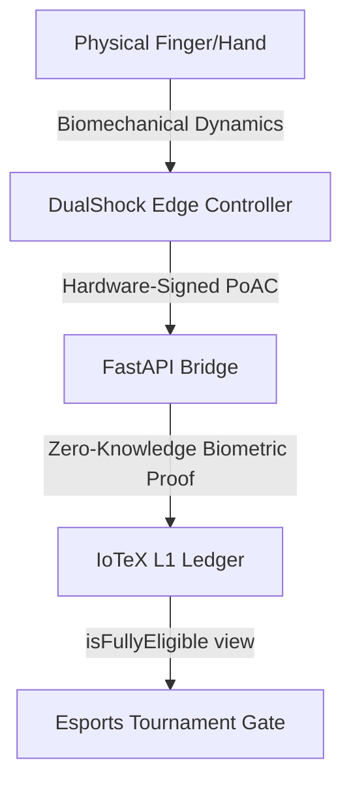

# QorTroller Architecture: In-Depth Features, Use Cases, & Zero-Trust Paradigm

This document provides a comprehensive technical assessment of **QorTroller**, the reference implementation of **Verifiable Autonomous Physical Intelligence (V.A.P.I.)** on the IoTeX network. It details the underlying cryptographic and physical trust models, specific use cases, and biometric features that are not fully elaborated in the main README.

---

## 1. The Zero-Trust Paradigm: V.A.P.I. vs. Ring-0 (Kernel) Anti-Cheat

Traditional anti-cheat systems (e.g., Riot Vanguard, Easy Anti-Cheat, BattlEye) operate under a **trusted-host model** with high system privilege. They monitor operating system memory, inspect running processes, and hook kernel routines at Ring 0. This model has three severe security and operational flaws:
1. **Host Compromise Vulnerability**: Cheats running on hardware DMA (Direct Memory Access) cards, external hardware pass-through devices (like Cronus Zen or XIM), or secondary cheat PCs are invisible to kernel drivers because the operating system itself is bypassed.
2. **Biometric & Consent Intrusiveness**: Kernel drivers gather broad system metrics, exposing user privacy to potential leaks and operating system instability.
3. **Integrator Trust**: Game developers and tournament organizers must trust a proprietary, closed-source anti-cheat API to make eligibility decisions.

### QorTroller's Zero-Trust Physical Trust Model
QorTroller flips the security model by treating the host machine as **entirely compromised**. Instead of checking the *software environment*, it validates the **physics of the physical input stream** at the hardware/sensor level:



- **Hardware-Rooted Proofs**: Raw inputs (accelerometer, gyroscope, triggers) are bound to a hardware-rooted signature directly on the controller, creating a **Proof of Autonomous Cognition (PoAC)**.
- **Physics-Backed Defense**: Bot scripts, DMA input injection, and Cronus macros cannot synthesize the biomechanical noise, postural gravity tremors, or muscle-latency feedback loops characteristic of a living human hand.

---

## 2. Deep-Dive: The PITL Layer Stack and Biometric Features

While the README summarizes the Physical Input Trust Layer (PITL) stack, the specific signals and mathematical models mapped to each layer include:

### L2: IMU Gravity & HID Discrepancy
* **Inference**: Analyzes the relationship between the physical gravity vector (measured by the internal 3-axis accelerometer) and active gameplay commands.
* **Mechanism**: If a bot script injects analog stick movements (e.g., strafing at exactly $100\%$ stick deflection) while the physical controller remains perfectly stationary on a desk (accelerometer variance $\sigma^2 \approx 0$), this discrepancy triggers a hard cheat block code (`0x28`).

### L3: TinyML Behavioral Classifier
* **Inference**: Runs edge-inference neural networks trained on high-dimensional human controller dynamics.
* **Mechanism**: Distinguishes human muscle-twitch acceleration curves from the step-function inputs typical of software bots. A bot injecting click events does so with zero pre-onset tension or muscle-microtravel; humans display a biomechanical acceleration ramp before trigger-clicks.

### L4: 13-Feature Mahalanobis Fingerprint
* **Inference**: Computes the distance of the active session's biometric fingerprint to the player's calibrated baseline.
* **Biometric Features**:
  1. **Postural Gravity roll_cos & roll_sin**: Anatomically stable gravity angles ($\cos/\sin(\theta_{roll})$) matching how the player physically holds the controller relative to their lap/desk,circular-encoded to avoid wraparound artifacts.
  2. **Postural Gravity pitch_cos**: Pitch postural angle ($\cos(\theta_{pitch})$).
  3. **Accel Tremor Peak Frequency (FFT)**: 4096-point zero-padded Fast Fourier Transform of raw acceleration, using parabolic sub-bin interpolation to pinpoint micro-tremors in the $4.0 - 15.0$ Hz band (anatomically unique postural tremor).
  4. **Touchpad Position Variance**: Center-of-mass dispersion of thumb placement during touchpad actions.
  5. **Touchpad Spatial Entropy**: Entropy of touch coordinates to detect synthetic linear swiping paths.

### L5: Temporal Rhythm & CoP
* **Inference**: Evaluates timing variance (Coefficient of Variation) and haptic-latency.
* **Mechanism**: Bots using macro clickers or turbo buttons display a strict timing interval (e.g., exactly $16.67$ ms between clicks). Humans, even when attempting rhythmic drumming, display a stochastic timing distribution conforming to fractional Brownian motion.

---

## 3. Replay Defenses: Proof of Session Recency (PoSR)

A core threat to physical anti-cheat is the **Replay Attack**: an adversary records a valid, human-generated PoAC stream from an earlier session and replays it to pass verification in a live tournament.

### The PoSR Temporal Anchor
QorTroller Arc 6 implements the **Proof of Session Recency (PoSR)** pipeline to defeat temporal replay. It binds session boundaries to recent block hashes anchored on IoTeX L1:

```
Open Commitment = SHA-256( BEACON_DOMAIN_TAG || Open_Block_Number || Open_Block_Hash || Device_ID || PoAC_Genesis_Link )
Close Commitment = SHA-256( BEACON_DOMAIN_TAG || Close_Block_Number || Close_Block_Hash || Open_Commitment || PoAC_Final_Link )
```

1. **At Session Open**: The bridge fetches the latest cadence-aligned block hash ($H_{open}$ from block $N_{open}$, anchored every 64 blocks on `VAPITemporalBeaconRegistry`) and incorporates it into the `Open Commitment`. Since $H_{open}$ is unpredictable before block $N_{open}$ is mined, the session demonstrably began *after* $N_{open}$.
2. **At Session Close**: The bridge incorporates the next anchored block hash ($H_{close}$) and the `Open Commitment` into the `Close Commitment`. This binds the close of the session to $N_{close}$, creating an immutable temporal envelope.
3. **In-Circuit Verification**: The ZK verifier checks the temporal ordering ($N_{close} > N_{open}$) and verifies that the Poseidon commitment matches the on-chain anchored block hashes. An attacker cannot replay a past session because its open beacon would point to a block hash outside the active tournament window.

---

## 4. Specific Use Cases and Integrations

### Esports Tournament Gating
* **Implementation**: Game clients query `VAPIProtocolLens.isFullyEligible(deviceIdHash)` before allowing a player lobby entry.
* **Integrator Benefit**: Minimizes tournament admin overhead. No need to install invasive PC kernel drivers or handle raw biometric user data (which triggers massive compliance liabilities). Eligibility is reduced to a single read-only call on IoTeX.

### DePIN Data Economy & Telemetry Monetization
* **Implementation**: Gamers upload their validated clean session logs to the VAPI Data Marketplace.
* **Integrator Benefit**: AI research labs, controller manufacturers, and hardware developers buy these datasets to train ergonomic models and behavioral agents.
* **Privacy Guardrail**: Players use ZKBA proofs to strip raw identifiers. The data buyer receives certified human telemetry without learning the gamer's real-world identity or physical address.

### Web3 Sybil Defense
* **Implementation**: Smart contracts gate token distribution, beta access, or item drops on holding a valid `VHP` (Verified Human Proof) credential bound to a certified controller.
* **Benefit**: Replaces easily circumvented bot challenges (CAPTCHA, SMS verification) with a cryptographic proof of physical gameplay liveness.
