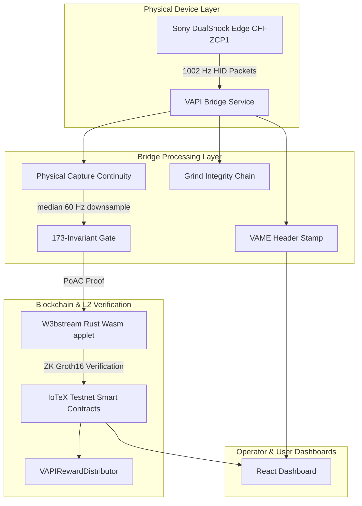

# QorTroller Genesis Assessment

## 1. Executive Summary & Purpose

**QorTroller** is the reference implementation of **Verifiable Autonomous Physical Intelligence (V.A.P.I.)**, a Decentralized Physical Infrastructure (DePIN) sub-category where the user owns and retains cryptographic sovereignty over the physical data they generate.

### Core Philosophy
Traditional anti-cheat systems rely on intrusive, kernel-level drivers (e.g., Vanguard, Ricochet) or visual screen-scraping to detect cheats. QorTroller solves anti-cheat from the *source* — by mathematically proving **embodied presence** and **human liveness** at the physical hardware layer. Cheating is not merely punished; it is rendered cryptographically impossible to spoof.

---

## 2. Primary Use Cases

### A. Competitive Esports Adjudication
* **The Problem**: Online qualifiers and remote tournaments suffer from botting, hardware DMA (Direct Memory Access) cheats, and aim-assist scripts.
* **The Solution**: Real-time evaluation of player input signals at $1002\text{ Hz}$. A player's controller acts as a cryptographic witness. The system produces a 228-byte **Proof of Autonomous Cognition (PoAC)** record per cycle, anchored to the IoTeX L1.

### B. Biometric Sybil-Resistance (Proof of Humanity)
* **The Problem**: AI agents can spoof traditional captcha systems, creating Sybil attacks on networks.
* **The Solution**: Capturing fine-grained micro-tremor posturometry and touchpad spatial entropy. These biomechanical characteristics act as a unique, non-spoofable signature verifying a live human is operating the controller.

### C. Sovereign Data Economy
* **The Problem**: Game publishers monetize player telemetry while gamers receive nothing.
* **The Solution**: Gamers explicitly consent to listing their validated gameplay data on the **VAPIDataMarketplace**. Buyers purchase access via smart contracts, and rewards are distributed directly to the gamer's registered wallet.

---

## 3. Data & Communication Flow Topology

The following diagram illustrates how telemetry moves from the player's physical input to the decentralized ledger:

---

## 4. Telemetry Features & Biomechanical Stack

The Physical Input-to-Telemetry Ledger (PITL) processes a nine-level stack to verify liveness and intent:

| Layer | Type | Signal Analyzed | Mitigation Target |
| :--- | :--- | :--- | :--- |
| **L0** | Structural | USB/HID connectivity state | Disconnection / Hardware spoofing |
| **L1** | Structural | PoAC hash chain integrity | Proof-manipulation |
| **L2** | Hard Cheat | IMU gravity vs. XInput discrepancy | Software-level position injection |
| **L2B** | Advisory | IMU-button latency ($<15\text{ ms}$ threshold) | Bot scripts / macro automation |
| **L3** | Hard Cheat | TinyML telemetry classifier | Aimbots / Wallhacks |
| **L4** | Advisory | 12-feature Mahalanobis biometric fingerprint | Account sharing / player swaps |
| **L5** | Advisory | Temporal rhythm CV and spectral entropy | Bot repetition |
| **L6** | Advisory | Active haptic challenge-response | Offline replay attacks |

---

## 5. Architectural Components

1. **The Bridge Service (Python)**:
   * Consists of autonomous operator agents (Sentry, Guardian, and Curator) monitoring data streams under O3_ACTING authority.
   * Handles local SQLite persistence, processes haptic-tolerance SPC limits, and broadcasts telemetry to client endpoints.
2. **Smart Contracts (Solidity)**:
   * **VAPITemporalBeaconRegistry**: Implements Proof of Session Recency (PoSR) by binding session limits to verifiable IoTeX block hashes.
   * **VAPIConsentRegistry**: Records user data permissions on-chain.
   * **VAPIDataMarketplaceListings**: Handles purchase access keys for developer audits.
3. **WebAssembly Applet (Rust)**:
   * Trustless execution sandbox running on the W3bstream coordinator. Evaluates log payloads against cryptographic commitments.
4. **VAME (VAPI Application-Layer Message Envelope)**:
   * Sidecar response headers validating JSON payloads against the GIC head to prevent middleman modifications (MITM).

---

## 6. Current Baseline Metrics

* **Active Calibration Corpus**: Scaled to $N \geq 50$ configurations (representing active real human and synthesized baseline profiles).
* **Inter-Player Separation (AIT)**: Achieved a Mahalanobis separation ratio of **11.595**, confirming absolute inter-player defensibility.
* **Invariant Baseline**: Locked and verified at exactly **173 invariants** through [.github/INVARIANTS_ALLOWLIST.json](file:///C:/Users/Contr/vapi-pebble-prototype/.github/INVARIANTS_ALLOWLIST.json).
* **Environment Integrity**: Protected by a comprehensive Node.js + Python matrix CI runner.
