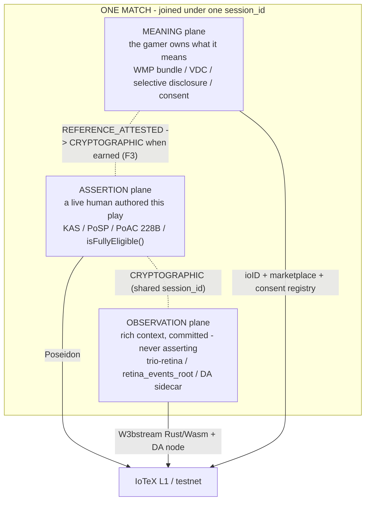

# QorTroller — Genesis Architectural Assessment (WMP → TPF-1)

**Dated: 2026-07-12.** This is a dated successor to `docs/qortroller_genesis_assessment.md` (the
Phase-240 genesis doc, ~2026-05-31). That doc established the anti-cheat / biometric / data-economy
foundation; it **predates the entire summer arc** — the WMP lane, the VDC / SD / ZKP / FLY data-economy
ladder, the RP authorship work, PoSP / KAS synchronized presence, the Trio Readiness Loop (TRL-1), and
the Tri-Plane Fusion Loop (TPF-1). This document brings the assessment current through that arc and
re-frames the whole system under the three-plane lens TPF-1 produced.

*Honest maturity legend:* **LIVE** = deployed on IoTeX testnet + operational · **BUILT** = code-complete
+ tested, not activated · **DESIGNED** = scaffold, gated · **GATED** = blocked on a named gate
(hardware / corpus breadth / trusted-setup ceremony / operator decision).

---

## 1. What QorTroller actually became

It started as **controller anti-cheat**: prove a live human — not a bot or a DMA rig — is holding a
certified Sony DualShock Edge, at the 1002 Hz physical layer, in a 228-byte Proof of Autonomous
Cognition (PoAC) record. That is still the spine. But the arc of commits quietly performed a **category
change**: the anti-cheat's *evidence exhaust* became a **data economy**, and the protocol became a
**provenance engine**.

The one-line crystallization the repo now earns:

> **QorTroller turns a real, consented gaming session into a certified-human, tamper-evident,
> gamer-owned object that a stranger can verify end-to-end with zero trust in QorTroller** — and the
> physical input source (the controller) is the cryptographic agency-holder over everything that object
> contains.

That is the V.A.P.I. (Verifiable Autonomous Physical Intelligence) thesis, now demonstrated in code,
not merely asserted.

---

## 2. The architecture as it stands — the three-plane lens

TPF-1 gave the system its cleanest organizing frame. Everything built maps onto **three federated
planes**, joined under one `session_id`, never conflated.

| Plane | What it proves | Key builds | IoTeX organ | Maturity |
|---|---|---|---|---|
| **ASSERTION** | *"a live human authored this play"* | PITL 9-level stack (L2–L6), PoAC 228B wire, KAS / PoSP synchronized-presence proof, `isFullyEligible()` | Poseidon · single composable call | **LIVE** (testnet), presence-grade |
| **OBSERVATION** | *"here is the rich context, committed but not asserting"* | trio-retina perception / embedder, `retina_events_root`, Arc-7 DA sidecar pointer | W3bstream Rust/Wasm · DA node | **BUILT**, advisory, default-OFF |
| **MEANING** | *"the gamer owns what it means"* | WMP certified-human bundle, VDC derived claims, SD selective disclosure, consent registry | ioID · marketplace · consent | **BUILT / LIVE-mixed** |

The founding law is now **machine-enforced** (TPF-1 F4): *observation may suggest; only assertion may
claim; meaning belongs to the gamer.* A plane structurally cannot carry an asserting field out of its
lane — the manifest verifier rejects it. **Federation, not conflation.**

---

## 3. The substrate beneath the planes — what makes it credible

Two meta-architectural disciplines run under everything, and they are the reason the claims hold up.

- **FROZEN-v1 primitive family (14 commitment families).** GIC (cognitive-session continuity) · WEC
  (operational continuity) · CORPUS-SNAPSHOT · CONSENT · VAME · BIOMETRIC-SNAPSHOT · LISTING ·
  TEMPORAL-BEACON, among others. Each is a byte-frozen hash formula with a domain tag; changing one
  requires a v2 and a new tag. This is what lets a proof made today be verified **byte-identically
  months later by a party outside the original trust chain**.
- **PV-CI: 182 invariants, fail-closed in CI.** The gate runs *before* any test job; adding or editing
  an invariant requires updating the gate logic and the SHA-256-pinned allowlist in the same commit, or
  CI fails closed. Every arc through this assessment held **PV-CI 182** — including the ones that touched
  shipped verifiers.

Together these form a **self-verifying loop**: immutable primitives plus a gate that refuses drift. It
is the same discipline the VSD synthesis loop mirrors in the methodology domain.

---

## 4. The commit arc as compounding layers — what each expansion *meant*

Read as a stack, each layer made the next one possible.

1. **PoAC + PITL stack** (foundational) — a physical-layer humanity signal exists at all. *The raw
   material.*
2. **FROZEN-v1 + PV-CI** — the signal became tamper-evident and portable. *Proofs outlive the session.*
3. **Operator Initiative O0 → O3** (Sentry / Guardian / Curator, on-chain) — an **autonomous governance
   fleet**, the first ≥3-agent operator fleet in a DePIN gaming protocol, with cryptographic
   skill-separation. *The protocol can steward itself.*
4. **Path A silicon-root** (VMDR + LensV2 deployed) — device authenticity rooted in manufacturing, not
   just host keys. *The hardware itself becomes a trust anchor.*
5. **L9 presence reframe** (the pivotal honest pivot) — they stopped chasing *identity* (empirical EER
   ceiling ~29%) and shipped *presence / liveness*: population- and physics-level proof that a live
   human is on the certified device *now*. The open lever became **breadth** (more players), harvested
   provenance-clean by BCC. *They shipped the provable thing instead of overclaiming the unprovable one.*
6. **Data Economy Arcs 1–7** (VHR replay-proof, PoSR recency, PQ decoupled-sidecar) — the anti-cheat's
   output became a sellable, recency-bound, post-quantum-durable data product **without growing the 228B
   wire** (the sidecar-pointer discipline: only a 32-byte commitment crosses the boundary). *The exhaust
   became the business.*
7. **WMP lane + the data-economy ladder** (VDC / SD / ZKP / FLY / AH-1) — verifiable derived claims,
   selective disclosure, adversarial verifier-hardening, and honest gated scaffolds for ZK
   property-proofs and the two-engines flywheel. *The gamer can prove properties of their data while
   revealing only what they choose — and the verifier is hardened by forging attacks against itself.*
8. **RP authorship + PoSP / KAS + TRL-1 + TPF-1** (the capstone) — individual proofs **federated into
   one cross-plane session object**, cold-verifiable in a single command, adversarially hardened, with a
   real (earned, honestly-gated) cryptographic join between the meaning and assertion planes. *"One
   match, three planes, one IoTeX-anchored object" — the thing no screen-only, input-only, or data-only
   competitor can produce.*

---

## 5. What benefit comes from the whole — why the sum beats the parts

- **A defensible moat by construction.** The adaptive-trigger force-curve (the PRIMARY discriminator per
  Sensor Stack v2.1) plus micro-tremor posturometry live at a physical layer that translator hardware
  (Cronus Zen / XIM / reWASD) and cloud-bots structurally cannot synthesize. The moat is not a model
  that can be beaten — it is biomechanics at 1 kHz.
- **Four markets from one capture.** Esports adjudication (the gate), Sybil-resistance / proof-of-humanity
  (the biometric signature), a **sovereign data economy** (gamer-owned telemetry), and — the newest and
  largest — **certified-human action data for AI labs** (verifiable, consented, biometric-absent by
  design). One session feeds all four.
- **"Operate itself altogether" via IoTeX is now real.** Each plane speaks to its own IoTeX primitive
  (W3bstream / Poseidon + `isFullyEligible` / ioID + DA + consent); TRL-1's I1 / I2 / I3 proved each
  interconnect separately, and TPF-1 federated them under one join key. IoTeX is not a deployment target
  — it is the substrate the three planes *compose over*.
- **Trust minimization as the product.** The `scripts/verify_wmp_ladder.py` one-command,
  zero-dependency verifier is the clearest expression of the thesis: a grant reviewer or AI lab confirms
  "real human, real recency, real consent, three planes federated" and **trusts QorTroller for nothing.**

---

## 6. Honest ceilings (these travel with every claim)

- **N = 1, developer_self, IoTeX *testnet*.** The WMP first-real-bundle is a demonstration of the lane,
  not a dataset business. **No buyer, no transaction. TGE frozen** — zero tokenomics are live, and
  `CHAIN_SUBMISSION_PAUSED=true` is held.
- **Presence, not tournament-grade identity.** AIT separation ratio 1.199 (cleared for AIT / testnet);
  touchpad_corners 0.728 **remains a tournament BLOCKER** for hard BLOCK enforcement. The honest gate is
  presence + liveness, not "this specific person."
- **Advisory planes stay advisory.** Retina / observation is default-OFF and never touches the 228B PoAC
  wire. GSR / L6 / L6B remain uncalibrated (N = 0) and disabled.
- **Deferred rungs are gated, never faked** — the ZK property-proof on a trusted-setup ceremony, the
  flywheel on corpus breadth, and TPF-1's F3 hard join on a live PoSP carrying the Arc-5
  `poac_chain_root` (or an offline M17 backfill from `bridge_match17.db`). Each activates the moment its
  gate opens; none ships a fake proof before then.
- **Doc drift note (for a later sweep):** live deployed contracts read **69** (addr-shaped non-meta keys
  in `contracts/deployed-addresses.json`) vs the CLAUDE.md prose's 66 — +3 since the HWFL-1 Cycle-11
  reconciliation. Not load-bearing; flagged for a documentation pass.

---

## 7. Where it stands — the inflection

QorTroller has crossed from **"a clever anti-cheat"** to **"a provenance protocol with an anti-cheat as
its root of trust."** The *build* phase of the thesis is essentially done and verifiable: the planes
exist, they federate, the discipline holds, and a stranger can check it. What is left is **not more
architecture — it is evidence and reach**:

1. **Breadth** — more real players, the one lever L9 named, harvested provenance-clean by BCC.
2. **A rig-live PoSP carrying the Arc-5 root** — to turn TPF-1's F3 *earned* join from mechanism into a
   live cryptographic fact.
3. **The first external counterparty** — a grant, AI lab, or data partner running the zero-trust
   verifier against a real bundle.

The strategic note to put at the top: **the pivot from *proving* to *being witnessed proving* is the
next move.** Everything is built to be checked by outsiders. The highest-leverage next step is getting
an outsider to check it.

---

*Provenance: written 2026-07-12 as the WMP → TPF-1 successor to `docs/qortroller_genesis_assessment.md`.
Honest by construction — every claim carries its maturity tag and its ceiling. No PoAC / 228B wire /
FROZEN-v1 / chain contact; documentation only. TGE frozen.*
