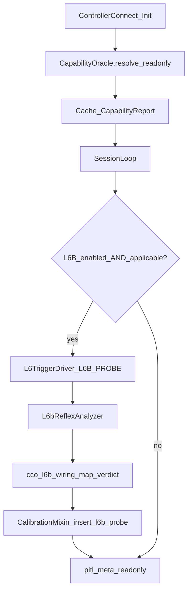

# CCO Phase B — L6B T0 Wiring Design v1

**Document ID:** CCO-PHASE-B-DESIGN-v1  
**Version:** 1.0  
**Date:** 2026-06-20  
**Status:** Operator-approved design — **no implementation** (plan mode)  
**Parent:** [`CCO_POEP_FUSION_v4.md`](CCO_POEP_FUSION_v4.md); [`CCO_T0_POLICY_v1.md`](CCO_T0_POLICY_v1.md); [`CCO_PHASE_A_ORACLE_CONTRACT_v1.md`](CCO_PHASE_A_ORACLE_CONTRACT_v1.md)  
**Hold:** B.1 implementation blocked until operator GO on this doc; **do not push** until operator moves to B.1.

---

## 0. Scope and naming

**Goal:** Wire Phase A `CapabilityReport` fields (`t0_engine`, `verdict_types_available`) to the existing L6B per-session reflex stack so controllers that pass the **applicability predicate** can emit telemetry-only **`REFLEX_OBSERVED`** verdicts. No PoEP activation, no on-chain work, no PoAC wire changes.

**Naming collision (F-PHASE-B-003):** Fusion roadmap §10 **Phase B** was the T0 *policy* decision ([`CCO_T0_POLICY_v1.md`](CCO_T0_POLICY_v1.md) — complete). **This document** defines **CCO Phase B** as *L6B T0 wiring* (implementation track).

**Constraints (unchanged):**

- `L6B_ENABLED=false` throughout planning; do not activate in B.1 CI.
- `poep_enabled=false`; no PoEP touch.
- [`capability_oracle.py`](../../bridge/vapi_bridge/capability_oracle.py) read-only input — **no edits** in Phase B.
- F-CCO-001 (CHIA enrich no-op) out of scope.

---

## 1. V-check findings (Step 1)

### 1.1 `bridge/controller/l6b_reflex_analyzer.py`

| Item | Repo fact |
|------|-----------|
| Entry point | Class `L6bReflexAnalyzer`; `analyze(pre_reports, post_reports, probe_ts)`; `classify(result) -> float` |
| Inputs | Lists of dicts with `ax`, `ay`, `az` (accel LSB); `probe_ts` = `time.monotonic()` at probe delivery |
| Output | `L6bReflexResult`: `latency_ms`, `accel_delta_peak`, `classification` ∈ `{HUMAN, BOT, INCONCLUSIVE, NO_RESPONSE}`, `confidence`, `valid` |
| 80–280 ms band | **Configurable:** `human_min_ms` (default 80), `human_max_ms` (default 280). **Fixed:** `BOT_MAX_MS = 15.0`. `accel_delta_threshold_lsb` default 500 |
| Profile state | **None** — controller-agnostic at analyzer layer |

### 1.2 `bridge/vapi_bridge/dualshock_integration.py`

| Item | Repo fact |
|------|-----------|
| Call site | `_session_loop()` |
| Cadence | Per-frame batch into pre/post buffers; probe dispatched every `l6b_probe_interval_ticks` (default 6750) |
| Guards | `l6b_enabled` from `Config`; probe requires `_l6b_analyzer`, `_l6_driver`, `_reader.ds` |
| Probe | `send_challenge(8, ds)` — profile 8 = `L6B_PROBE` (DualSense adaptive trigger) |
| Output today | `l6b_p_human` → `humanity_probability`; `insert_l6b_probe()` → DB; `pitl_meta` fields. **No `REFLEX_OBSERVED` string** |

### 1.3 `bridge/vapi_bridge/capability_oracle.py` (Phase A)

All contract fields present on `CapabilityReport`. Per-class V-check:

| Profile | `presence_ceiling_candidate` | `challenge_type_candidate` | `characterization_status` |
|---------|------------------------------|----------------------------|---------------------------|
| DualShock Edge | P-T3 | adaptive_force | PARTIAL_EDGE_ONLY |
| Battle Beaver (`profile_id` override) | P-T3 | adaptive_force | PARTIAL_EDGE_ONLY |
| DualSense / SCUF | P-T1 | rumble_imu | UNCHARACTERIZED |
| Xbox Elite S2 / HORI | P-T0 | button_timing | UNCHARACTERIZED |
| Unknown | P-T0 | generic_input_timing | UNCHARACTERIZED |

`t0_engine` = `"L6B"` and `verdict_types_available` = `("REFLEX_OBSERVED",)` for **all** profiles (policy routing constant).

### 1.4 `CCO_T0_POLICY_v1.md`

- Option C: L6B → P-T0 `REFLEX_OBSERVED` (telemetry); PoEP → P-T2/T3 `PRESENT` (gated).
- Defaults: `L6B_ENABLED=false`, `poep_enabled=false`.
- Live activation: operator **N≥50** L6B calibration hard rule ([`CLAUDE.md`](../../CLAUDE.md)); env flag `L6B_ENABLED=true` only — no two-key ceremony.

### 1.5 F-CCO-001

[`device_registry._enrich_profile`](../../bridge/vapi_bridge/device_registry.py) compares `cp.usb_vid` to `base_profile.vid` — `DeviceProfile` uses `hid_vendor_id`. Enrichment no-ops. **Does not affect L6B** (raw HID/IMU path).

### 1.6 DECON-2 store location V-check (closed 2026-06-20)

Pre-B.1 grep: `l6b_probe_log` / `insert_l6b_probe` under `bridge/vapi_bridge/store/`:

| Artifact | File | Notes |
|----------|------|-------|
| `CREATE TABLE l6b_probe_log` | [`store/_core.py`](../../bridge/vapi_bridge/store/_core.py) ~L681 | Schema centralized in `_init_schema()` per D-DECON-2 |
| `insert_l6b_probe()`, `get_l6b_baseline()` | [`store/calibration.py`](../../bridge/vapi_bridge/store/calibration.py) (`CalibrationMixin`) | Wired via `Store(..., CalibrationMixin)` MRO in `_core.py` |

**B.1 store change targets:**

- **Column additions / idempotent `ALTER TABLE`:** `_core.py` migration block (same discipline as other Phase migrations).
- **`insert_l6b_probe` signature + INSERT columns:** `calibration.py` only.

Do **not** assume methods live in `_core.py` because the table CREATE does. Re-grep before any B.1 store commit (INV-022-class risk from DECON-2 extractions).

### 1.7 Named findings summary

| ID | Finding |
|----|---------|
| **F-PHASE-B-001** | End-to-end L6B is **not** universal: DualSense haptic probe + IMU required; session loop hardcodes `0x054C:0x0DF2` for PCC HID counter |
| **F-PHASE-B-002** | L6B classifies `HUMAN`/`BOT`/etc. — mapping layer required for `REFLEX_OBSERVED` |
| **F-PHASE-B-003** | Roadmap Phase B (policy) vs this Phase B (wiring) naming collision |
| **F-PHASE-B-004** | Oracle advertises `REFLEX_OBSERVED` for all profiles; runtime delivery gated by applicability predicate — **contract addendum** in [`CCO_PHASE_A_ORACLE_CONTRACT_v1.md`](CCO_PHASE_A_ORACLE_CONTRACT_v1.md) |
| **F-PHASE-B-005** | `REFLEX_OBSERVED` is non-gating for tournament/PoEP; `l6b_p_human` still affects advisory `humanity_probability` when L6B active — document, do not conflate |

---

## 2. Design questions Q1–Q6

### Q1 — Controller-agnostic?

**Analyzer:** Yes. **Stack:** No (**F-PHASE-B-001**). Phase B wires existing DualSense adaptive-trigger + IMU path only. Per-class haptic adapters (`rumble_imu`, `button_timing`) are **future**, not B.1.

### Q2 — CCO integration point

Resolve **once at session start** (after `DeviceProfileRegistry.resolve()`, before `_session_loop`). Cache `CapabilityReport` on `DualShockIntegration` (e.g. `_cco_capability_report`). Injection site: controller init in [`dualshock_integration.py`](../../bridge/vapi_bridge/dualshock_integration.py). Do not re-resolve per probe window.

### Q3 — REFLEX_OBSERVED propagation

Minimal telemetry path:

1. Map `classification == "HUMAN"` → `REFLEX_OBSERVED`; otherwise no observed verdict (never `PRESENT`).
2. Extend `insert_l6b_probe` in **`calibration.py`** with optional `reflex_verdict`, `cco_profile_id`, `policy_ref`; schema migration in **`_core.py`**.
3. Read-only `pitl_meta` / session-status fields: `cco_reflex_verdict`, `cco_presence_ceiling_candidate`, `cco_t0_engine`.
4. Optional HTTP surface deferred to **B.2**.

No PoAC 228-byte changes; no on-chain anchor; no tournament gating.

### Q4 — Operator gate for `L6B_ENABLED=true`

1. `L6B_ENABLED=true` in `bridge/.env` (only mechanism today).
2. **N≥50** L6B calibration corpus ([`CLAUDE.md`](../../CLAUDE.md) hard rule; current N=0).
3. B.1 P-checks green with default `false` in CI.
4. No FROZEN-v1 / governance ceremony for `REFLEX_OBSERVED` (telemetry label).

### Q5 — Non-Edge controllers

**Honest bound:** T0 via **this** L6B stack is **IMU + DualSense haptic gated**, not universal.

| Controller | B.1 behavior |
|------------|--------------|
| Edge (adaptive + IMU) | Run L6B when enabled; HUMAN → `REFLEX_OBSERVED` |
| DualSense / SCUF (IMU, no adaptive) | Skip probe; `L6B_SKIPPED` / `NO_ADAPTIVE_TRIGGER_PATH` |
| Xbox / HORI (no IMU) | Skip probe; `L6B_SKIPPED` / `NO_IMU` |
| Generic unknown | Skip unless hardware path succeeds |

### Q6 — Battle Beaver / `profile_id` override

Wiring consumes cached `CapabilityReport` only — resolution path (VID/PID vs `profile_id`) is irrelevant except audit field `cco_profile_id` on stored rows.

---

## 3. Wiring architecture

**Applicability predicate** (implemented in [`cco_l6b_wiring.py`](../../bridge/vapi_bridge/cco_l6b_wiring.py)):

`report.t0_engine == "L6B"` AND `capabilities.has_accelerometer` AND `l6_driver` present AND DualSense handle available.

Pure-module pattern mirrors [`sensor_b_supply_watch.py`](../../bridge/vapi_bridge/sensor_b_supply_watch.py): applicability, skip reasons, `HUMAN` → `REFLEX_OBSERVED` mapping — independently testable.

---

## 4. Proposed file changes (B.1 — names only)

| File | Change |
|------|--------|
| [`bridge/vapi_bridge/cco_l6b_wiring.py`](../../bridge/vapi_bridge/cco_l6b_wiring.py) | **NEW** — applicability, verdict mapping, skip reason enums |
| [`bridge/vapi_bridge/dualshock_integration.py`](../../bridge/vapi_bridge/dualshock_integration.py) | Cache CCO report; gate probes; call wiring module on completion |
| [`bridge/vapi_bridge/store/calibration.py`](../../bridge/vapi_bridge/store/calibration.py) | Extend `insert_l6b_probe` / `get_l6b_baseline` for new columns |
| [`bridge/vapi_bridge/store/_core.py`](../../bridge/vapi_bridge/store/_core.py) | Idempotent `ALTER TABLE l6b_probe_log` migration only |
| [`bridge/tests/test_cco_l6b_wiring.py`](../../bridge/tests/test_cco_l6b_wiring.py) | **NEW** — mapping, applicability, skip reasons |
| [`bridge/tests/test_l6b_bridge_integration.py`](../../bridge/tests/test_l6b_bridge_integration.py) | Store round-trip for new columns |

**B.2 (deferred):** [`bridge/vapi_bridge/operator_api/_app.py`](../../bridge/vapi_bridge/operator_api/_app.py) session-status fields.

**Not modified:** `capability_oracle.py`, PoEP, contracts, F-CCO-001 site.

---

## 5. Operator gate (before `L6B_ENABLED=true`)

1. Phase B implementation merged; tests pass with `L6B_ENABLED=false`.
2. Operator attests **N≥50** L6B calibration sessions.
3. DualSense-class hardware validated (IMU + adaptive trigger path).
4. `poep_enabled` remains false; `REFLEX_OBSERVED` does not imply tournament eligibility.

---

## 6. Stop condition (Phase B complete)

- Cached `CapabilityReport` drives L6B applicability in `dualshock_integration`.
- Probes persist `reflex_verdict` in `l6b_probe_log` via `CalibrationMixin`.
- IMU-less / non-adaptive profiles log explicit skip — no spurious `REFLEX_OBSERVED`.
- `pitl_meta` exposes latest CCO reflex telemetry (read-only).
- All tests pass; **`L6B_ENABLED` default remains `false`** in CI.
- No PoAC / on-chain / oracle edits.

---

## 7. B.1 pre-commit V-check checklist

1. Re-run: `grep -r "l6b_probe_log\|insert_l6b_probe" bridge/vapi_bridge/store/` — confirm targets unchanged.
2. Confirm CREATE in `_core.py`, insert in `calibration.py`.
3. `pytest bridge/tests/test_cco_l6b_wiring.py bridge/tests/test_l6b_bridge_integration.py -q`
4. Regression: `L6B_ENABLED=false` — no behavior delta vs pre-B.1.

---

## 8. Sub-phase ordering

| Sub-phase | Scope |
|-----------|--------|
| **B.1** | `cco_l6b_wiring.py` + dualshock + store + tests |
| **B.2** | Session-status / optional HTTP read surface |
| **B.3** | Operator activation runbook (no default flag flip) |

---

## Document history

| Date | Change |
|------|--------|
| 2026-06-20 | Initial design — operator-approved; DECON-2 store V-check closed; F-PHASE-B-004 contract addendum cross-ref |
